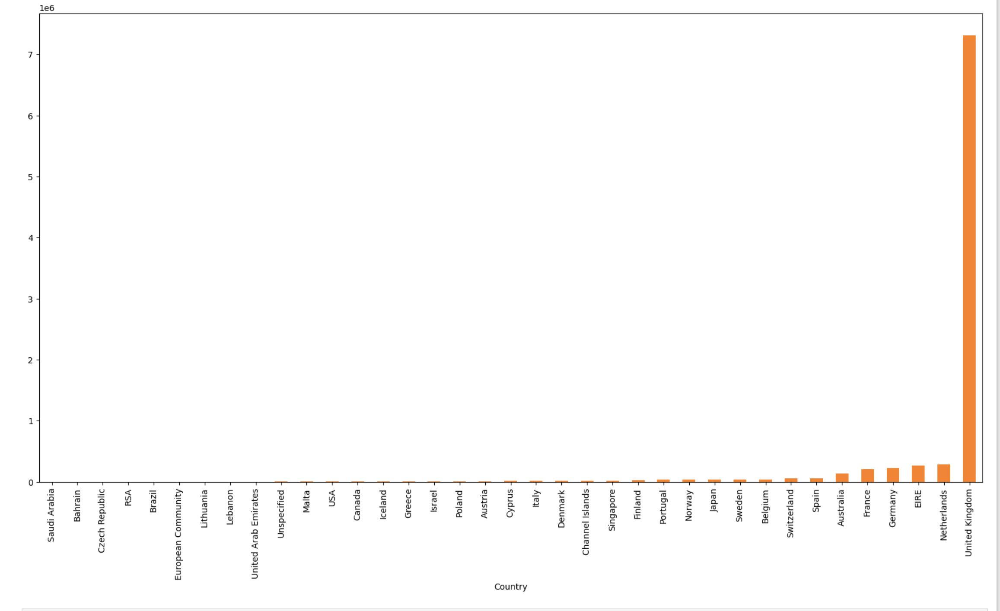
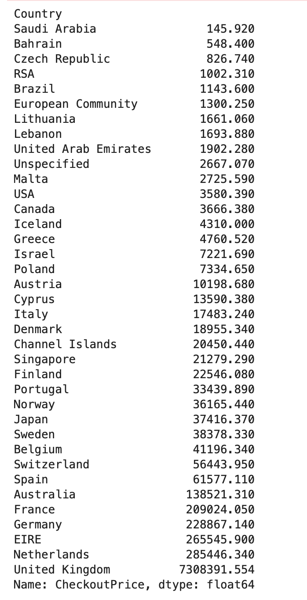
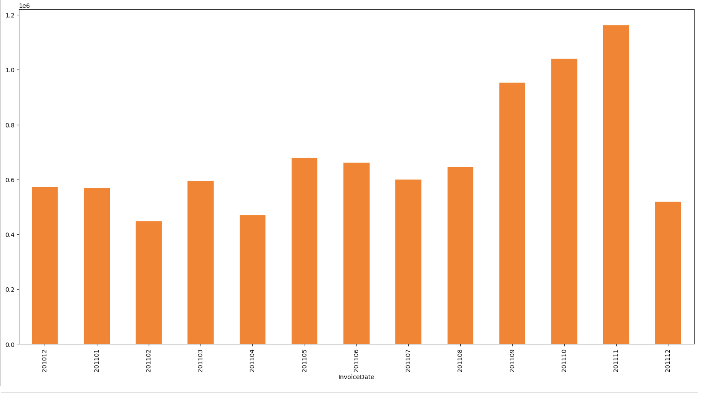
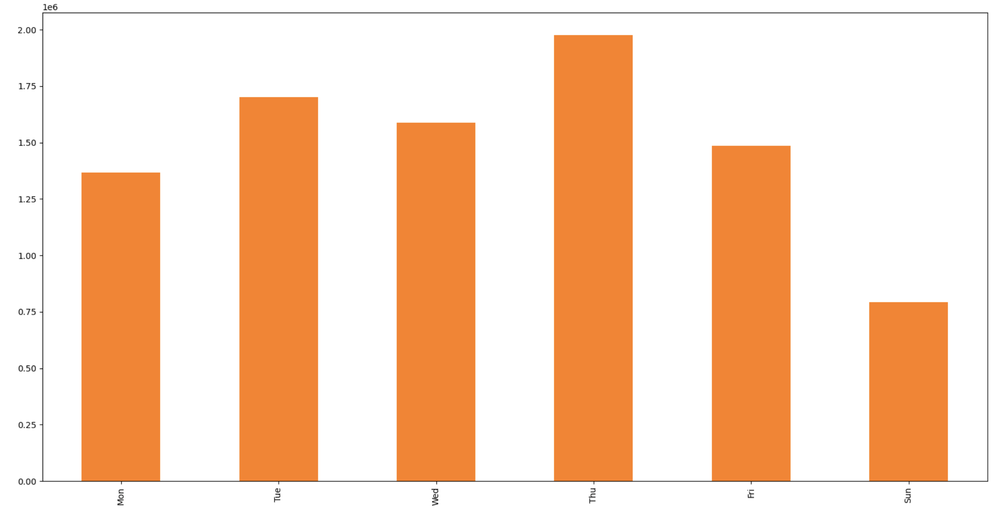
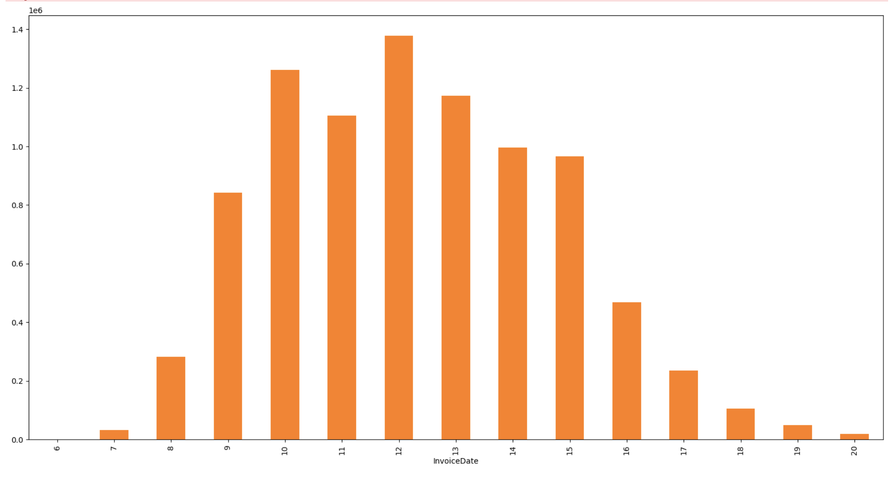
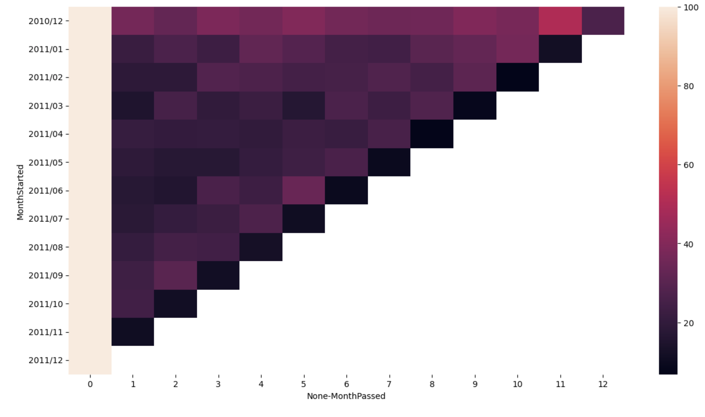
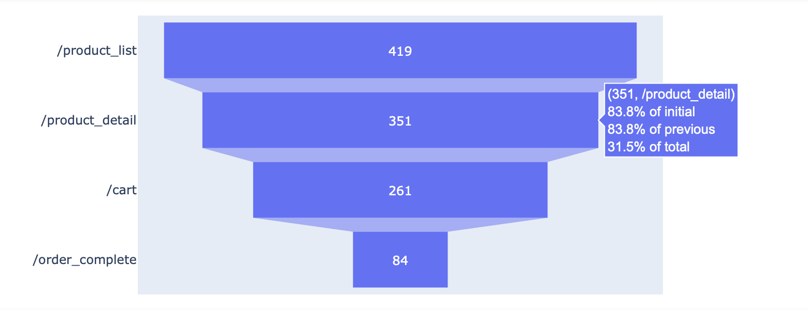

# 🛍️ Shopping Mall Customer Behavior Analysis

Understand customer behavior patterns, identify peak purchasing times, and build a foundation for personalized marketing strategies.  
— A data analysis project using Python, Pandas, and visualization tools to extract insights from online retail data.

---

## Key Findings

- **82% of total sales come from the UK** — strong regional concentration  
- **November has the highest number of orders in 2011**, followed by December (incomplete)  
- **Peak sales occur during late morning (11 AM – 12 PM)**  
- **Orders begin at 7 AM and sharply decline after 3 PM**  
- **No orders were placed on Saturdays**  
- **Customers often drop off just before checkout** — indicating potential UI/UX friction  

---

## Project Goal

Identify sales patterns and customer drop-off behavior to support data-driven marketing and personalized coupon campaigns.

---
## 📈 Project Workflow

### 1. Data Cleaning & Feature Engineering

- Dropped 135,000+ `NULL` values in `CustomerID`  
- Removed negative quantity or zero-priced records  
- Converted `InvoiceDate` to timestamp + extracted:
  - Month
  - Weekday
  - Hour

---

### 2. Sales by Country

- 🇬🇧 UK alone accounts for **7.3 million+** in sales  
- The next top country (Netherlands) only reaches ~285,000

📊 **Sales by Country (Bar Chart)**  

📃 **Sales Breakdown Table**  

---

### 3. Sales Trend Analysis

📆 **Monthly Sales Trend**  
- November shows the highest spike  
- December looks lower due to partial data

📅 **Sales by Weekday**  
- Strongest activity: Mon → Fri  
- Zero activity on Saturday

🕒 **Sales by Hour (Time of Day)**  
- Orders spike around **10–12 PM**
- Sharp decline after **3 PM**

---

### 4. Retention (Cohort Analysis)

- Monthly cohorts based on first purchase
- Retention drops to ~10% by month 3–4

📊 **Cohort Heatmap**  

---

### 5. Funnel Analysis (User Journey)

- 419 people viewed product list  
- Only 84 completed the order  
- Major drop-off at `/cart`

📉 **Funnel Visualization**  

---

## 🧠 Tools Used

- `Python`, `Pandas`, `NumPy`  
- `Matplotlib`, `Seaborn` for plots  
- `Jupyter Notebook`  
- `Pivot Tables`, `GroupBy`, `Datetime Parsing`

---
## Analysis Flow

### 1. Data Understanding & Cleansing
- Loaded and inspected `OnlineRetail.csv`
- Removed 135,080 rows with null values (`CustomerID`)
- Filtered invalid transactions (e.g., negative quantity, zero price)

### 2. Exploratory Data Analysis (EDA)
- Identified top-selling items by volume and revenue
- Explored sales trends by:
  - Month
  - Weekday
  - Hour
  - Country

### 3. Customer Segmentation
- Grouped customers by:
  - Purchase frequency
  - Total spending
- Identified **high-value customers (VIPs)**

### 4. Cohort & Retention Analysis
- Monthly cohort grouping using first-purchase month
- Calculated monthly **retention rates**
- Visualized with heatmaps

### 5. Exit Funnel Analysis
- Parsed **web server log-style** data
- Built a **funnel table** to identify common exit pages
- Found key drop-off steps based on session sequences

### 6. Personalized Push Strategy
- Identified **per-user peak purchase hours**
- Proposed **personalized coupon delivery** based on individual behavior

---

## Tools & Tech Used

- **Pandas, NumPy** – data cleaning & transformation  
- **Matplotlib, Seaborn** – visualization & heatmaps  
- **Datetime, Lambda functions** – time feature engineering  
- **Git, Jupyter Notebook** – version control & presentation  

---

